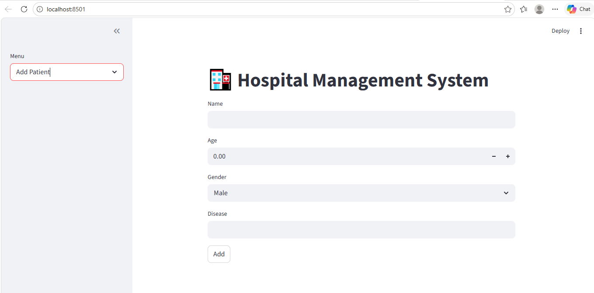

# 🏥 Hospital Management System

A **Hospital Management System** built with **Python** and **Streamlit**, featuring login authentication, patient & doctor management, and appointment booking.  

This project demonstrates a practical CRUD application with a clean and interactive GUI.

## **Features**

- 🔐 **Login Authentication** – Secure login and logout functionality  
- 🏥 **Patient Management**
  - Add new patients (Name, Age, Gender, Disease)  
  - View all patients in a list  
- 👩‍⚕️ **Doctor Management**
  - Add new doctors (Name, Specialization)  
- 📅 **Appointment Booking**
  - Book appointments between patients and doctors with a date  


## **Tech Stack**

- Python  
- Streamlit (GUI)  
- Modular code structure (`modules/patient.py`, `modules/doctor.py`, `modules/appointment.py`)  


## **Screenshots**
## Screenshots

### 1️⃣ Login Screen
  
Login page where users enter **username and password** to access the system.

### 2️⃣ Add Patient
  
Screen to add a **new patient** with name, age, gender, and disease details.

### 3️⃣ View Patients
  
Displays a **list of all patients** in the database with their details.

### 4️⃣ Add Doctor
  
Screen to add a **new doctor** with name and specialization.


## **Getting Started**

### **1. Clone the Repository**
```bash
git clone https://github.com/<your-username>/hospital-management-system.git
cd hospital-management-system
